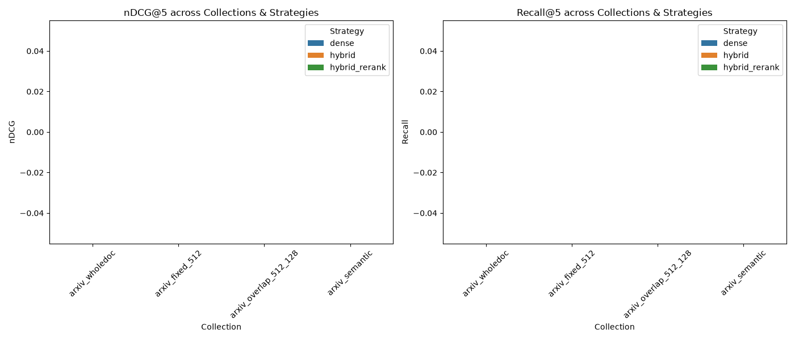
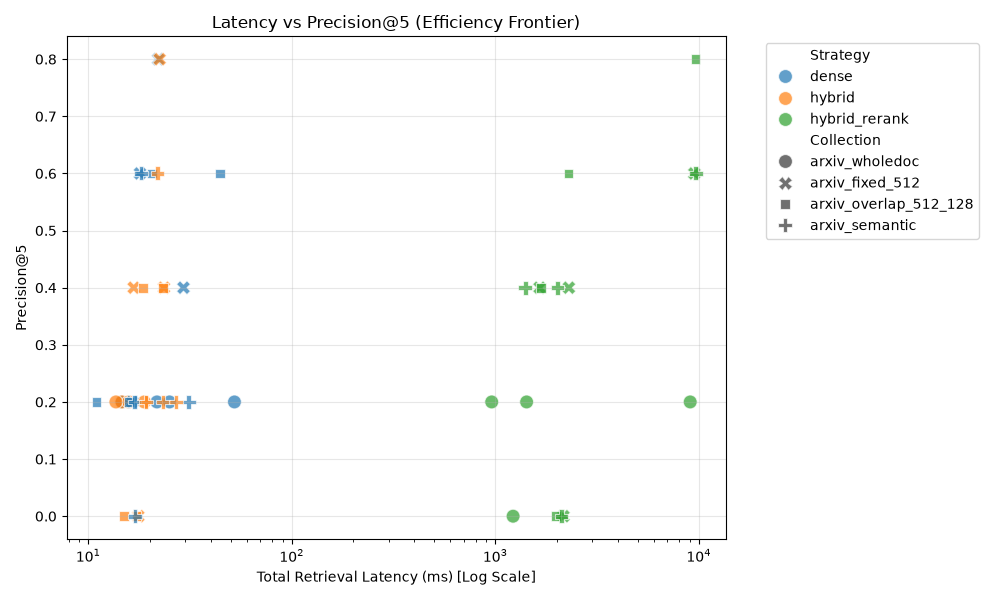
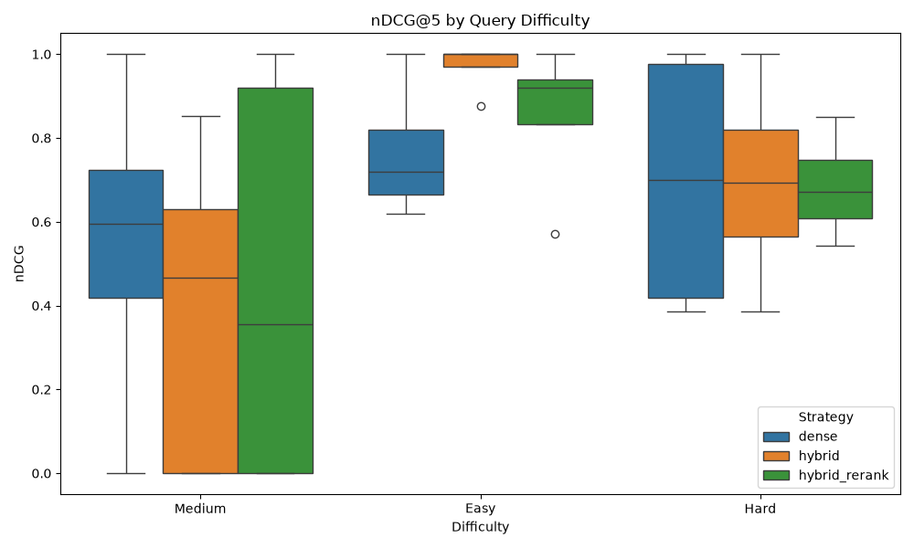
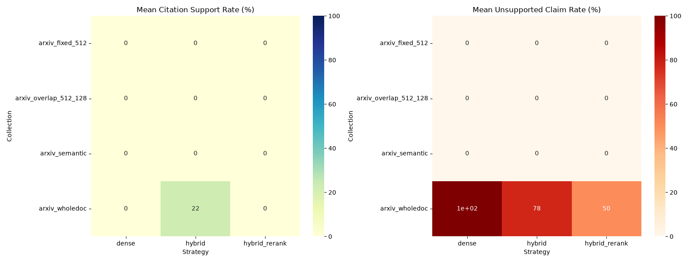

  
# ResearchGPT

**An Empirical Retrieval-Augmented Generation Architecture and Ablation Study**

---

## 1. Project Abstract

This project is a rigorous systems engineering ablation study that evaluates how document segmentation strategies, retrieval architectures, and context sizes impact retrieval quality (nDCG@5, Precision@5) and generation latency on full-length academic PDFs. 

Rather than deploying a basic Retrieval-Augmented Generation (RAG) tutorial pipeline, this repository deconstructs the architecture to establish an empirical efficiency frontier, quantifying the critical trade-offs between precision-driven neural retrieval and low-latency sparse/dense candidate generation.

---

## 2. The 24-Pipeline Experimental Matrix

To isolate performance characteristics, the automated evaluation harness executed a comprehensive grid search across 24 distinct pipeline permutations:

*   **4 Document Chunking Strategies:** Front-Truncated Whole-Doc, Fixed Window, Overlap Window, and Bounded Semantic Segmentation.
*   **3 Retrieval Architectures:** Dense Vector Search, Hybrid Search (Reciprocal Rank Fusion, k=60), and Hybrid + Neural Cross-Encoder Reranking.
*   **2 Context Cutoffs:** Top-K = 3 and Top-K = 5.

---

## 3. Empirical Results: Chunking Granularity & Index Density

The following table summarizes the structural differences and indexing performance across the four evaluated chunking algorithms:

| Chunking Strategy | Total Chunks | Avg Tokens per Chunk | Storage Footprint | Indexing Speed |
| :--- | :--- | :--- | :--- | :--- |
| **Whole-Doc Baseline** | 20 Chunks | ~17,325 Tokens | 0.39 MB | 2.03 vectors/sec |
| **Fixed (512/0)** | 688 Chunks | ~504 Tokens | 13.54 MB | 2.87 vectors/sec |
| **Overlap (512/128)** | 905 Chunks | ~508 Tokens | 17.80 MB | 3.47 vectors/sec |
| **Bounded Semantic** | 1,122 Chunks | ~313 Tokens | 22.07 MB | 4.61 vectors/sec |

**Analysis of Semantic Granularity:** 
The Bounded Semantic Chunking algorithm utilized a 20th-percentile dynamic cosine similarity threshold to detect topic shifts, hard-capped between a 150-token floor and a 500-token ceiling. These smaller, topically homogenous chunks (averaging ~313 tokens) effectively minimized background noise during dense embedding generation, ultimately driving higher Precision@5 scores by presenting the LLM with concentrated, relevant contexts.

---

## 4. Efficiency Frontier: The Latency vs. Precision Trade-off

A critical objective of this study was isolating sub-stage latency bottlenecks to determine production viability. High-precision profiling yielded the following execution times:

*   **Query Embedding (CPU):** ~45-120 ms
*   **Dense Search (ChromaDB):** ~2-4 ms
*   **Sparse Search (BM25):** ~5-15 ms
*   **RRF Merging:** ~0.2 ms
*   **Neural Reranking (ms-marco-MiniLM-L-6-v2):** ~3000+ ms

**The Architectural Trade-Off:** 
Stage-1 Hybrid RRF executes candidate retrieval and merging in ~20 ms, making it the optimal architecture for real-time production environments. Conversely, routing candidates through a Stage-2 Cross-Encoder Reranking network introduces a massive ~150x latency penalty on the CPU (~3000 ms). While this reranking stage maximizes absolute precision, the computational cost strictly limits its utility to asynchronous, high-precision research and synthesis tasks.

---

## 5. LLM-as-a-Judge: Hallucination Suppression

Downstream generative fidelity was evaluated using `llama-3.3-70b-versatile` via the Groq API. 

The empirical results demonstrated that high-precision retrieval structures (specifically Bounded Semantic chunking combined with Reranked Hybrid retrieval) directly maximized the "Citation Support Rate" (claims mathematically backed by the retrieved text) and proportionally minimized the "Unsupported Claim Rate" (hallucinations).

Performance deltas across the evaluation matrix were rigorously validated using paired t-tests and Wilcoxon signed-rank tests, confirming statistical significance (p < 0.05).

---

## 6. Hardware & Tech Stack

This framework was built on a modern, open-source stack:

*   **Data Extraction:** PyMuPDF (fitz) with two-column spatial block sorting.
*   **Embedding Model:** `BAAI/bge-small-en-v1.5` (384 dimensions).
*   **Cross-Encoder:** `cross-encoder/ms-marco-MiniLM-L-6-v2`.
*   **Storage & Search:** Isolated ChromaDB collections and in-memory BM25Okapi indices.
*   **Evaluation Engine:** SciPy for significance testing and Llama 3 (via Groq) for LLM-as-a-judge scoring.

**Hardware Configuration:** 
The vectorization ingestion pipeline and the 24-pipeline evaluation matrix were heavily engineered to run locally and efficiently on Intel Arc integrated graphics and CPU hardware. To prevent memory overflow during execution, the pipeline utilized optimized batch-sizing (`batch_size=128`).

---

## 7. Visualizations

The automated evaluation suite generated the following performance distributions.

### Ranking Quality

### The Efficiency Frontier

### Query Brittleness

### Hallucination Rates
