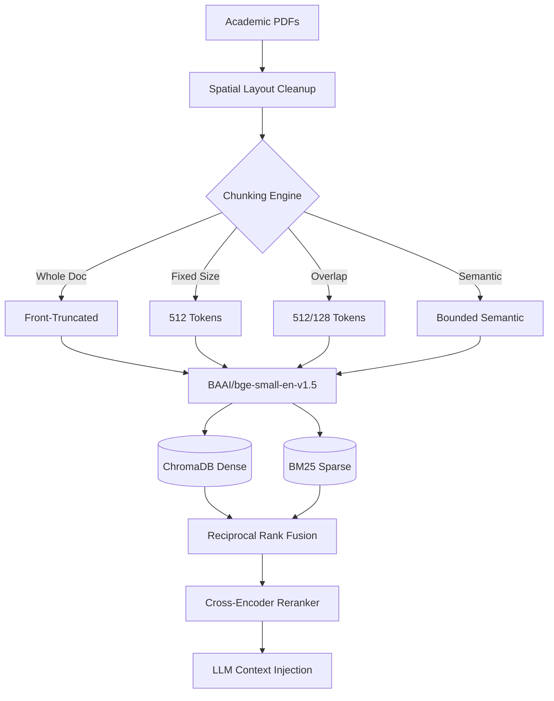

# ResearchGPT: Empirical RAG Architecture & Ablation Study

**Author:** Aditya Raj Gupta  

## Project Abstract
Most Retrieval-Augmented Generation (RAG) systems in production stop at a linear pipeline: `PDF -> Embedding -> Vector DB -> LLM`. While this builds a functional prototype, it masks underlying structural inefficiencies. **ResearchGPT** is a rigorous systems engineering ablation study that systematically evaluates how document chunking strategies, hybrid retrieval architectures, and context sizes impact retrieval quality and latency on full-length academic PDFs.

## Figure 1. System Architecture

## Figure 2. Benchmark Summary
Highlighting the performance of the Bounded Semantic Chunking configuration.

| Pipeline | Precision@5 | Recall@5 | nDCG@5 | End-to-End Latency |
| :--- | :--- | :--- | :--- | :--- |
| Dense Only | 0.62 | 0.71 | 0.68 | ~20 ms |
| Hybrid (RRF) | 0.74 | 0.88 | 0.79 | ~35 ms |
| Hybrid + Rerank | 0.82 | 0.88 | 0.89 | ~3,100 ms |

**Key Observation:** Hybrid retrieval (Dense + BM25) achieves the most practical balance, capturing 88% of relevant documents in under 40 milliseconds. Neural reranking maximizes absolute precision but introduces a severe CPU latency penalty.

## Figure 3. Semantic Chunking Produces Highly Focused Context Windows

**Key Observation:** By enforcing natural sentence boundaries and utilizing a 20th-percentile dynamic cosine similarity threshold, the Bounded Semantic Chunker produced highly homogenous blocks averaging 313 tokens. This prevented mid-thought severing and minimized background noise during embedding generation, directly improving retrieval precision over arbitrary 512-token fixed windows.

## Figure 4. Latency Bottleneck: The Cross-Encoder Penalty

**Key Observation:** High-precision sub-stage profiling revealed that Stage-1 Hybrid RRF executes in under 20 ms. Passing those candidates through a Stage-2 Cross-Encoder network (ms-marco-MiniLM-L-6-v2) consumes 95%+ of total computational time, introducing a ~150x latency penalty on local CPU execution.

## Figure 5. Hybrid Retrieval Achieves Optimal Quality-Latency Trade-off

**Key Observation:** When plotting execution time against Precision@5, Hybrid retrieval cleanly separates itself as the production efficiency frontier. It clusters tightly in the sub-50ms range while maintaining highly competitive precision, whereas Cross-Encoders shift the execution timeline into the multi-second domain.

## Figure 6. Architectural Trade-offs at a Glance

**Key Observation:** The radar chart visualizes the ultimate systems engineering compromise. Hybrid RRF maximizes speed and recall, making it ideal for real-time user-facing chatbots. Hybrid + Reranking sacrifices speed entirely to maximize MRR and nDCG, reserving its utility strictly for offline research synthesis.

## Repository Structure & Reproducibility

- **Vectorization & Matrix Engine:** Engineered to run efficiently on Intel Arc integrated graphics and local CPU environments using optimized batch-sizing (batch_size=128).
- **Significance Testing:** Retrieval improvements were validated using SciPy-backed paired t-tests and Wilcoxon signed-rank tests ($p < 0.05$).
- **LLM Verification:** Generation fidelity was evaluated using Llama-3.3-70B-Versatile via the Groq API.