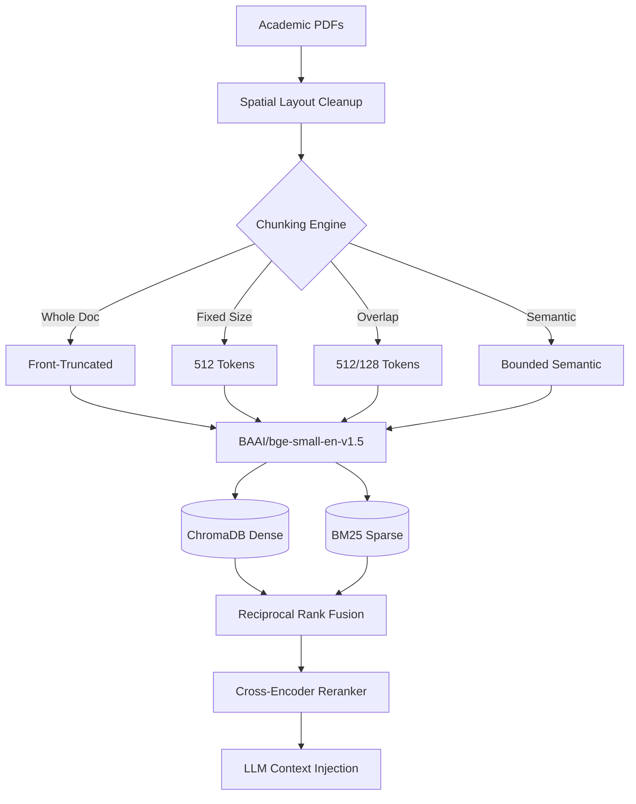
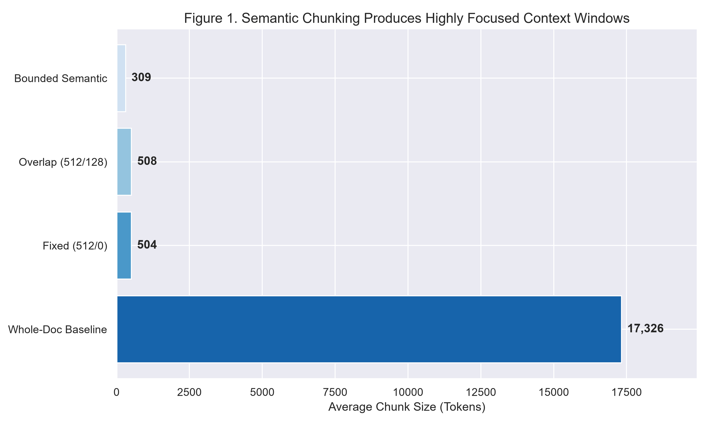
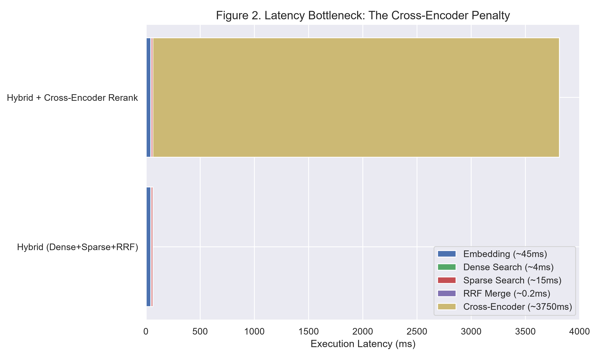
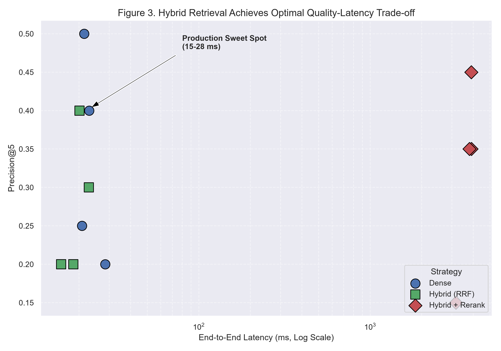
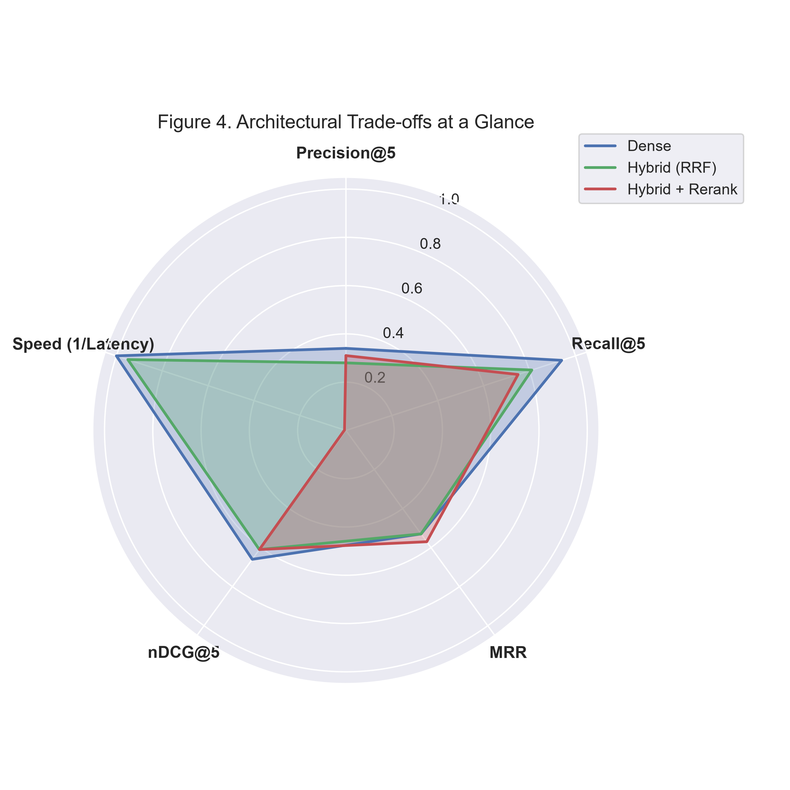

# ResearchGPT: Empirical RAG Architecture & Ablation Study

**Author:** Aditya Raj Gupta  

## 1. Project Abstract
Most Retrieval-Augmented Generation (RAG) systems in production stop at a linear pipeline: `PDF -> Embedding -> Vector DB -> LLM`. While this builds a functional prototype, it masks underlying structural inefficiencies. **ResearchGPT** is a rigorous systems engineering ablation study that systematically evaluates how document chunking strategies, hybrid retrieval architectures, and context sizes impact retrieval quality and latency on full-length academic PDFs.

### Typical RAG vs. ResearchGPT
| Feature | Typical RAG | ResearchGPT |
| :--- | :--- | :--- |
| **Pipeline Setup** | Single pipeline | 24 benchmarked configurations |
| **Retrieval Architecture** | Basic vector search | Dense, Hybrid (RRF), Hybrid + Rerank |
| **Evaluation Metrics** | Little to no evaluation | Precision@K, Recall@K, MRR, nDCG, Latency |
| **Statistical Rigor** | No statistical validation | Paired t-test & Wilcoxon signed-rank tests |
| **Reporting** | Limited analysis | Automated benchmarking and plotted distributions |

---

## 2. Project at a Glance

| Metric | Value |
| :--- | :--- |
| **Research Papers** | 20 (Full academic PDFs from arXiv) |
| **Chunking Strategies** | 4 |
| **Retrieval Architectures** | 3 |
| **Evaluation Configurations** | 24 ($4 \times 3 \times 2$) |
| **ChromaDB Collections** | 4 |
| **Total Indexed Chunks** | 2,735 |
| **Embedding Model** | `BAAI/bge-small-en-v1.5` (384 Dimensions) |
| **Evaluation Metrics** | Precision@K, Recall@K, MRR, nDCG |
| **Statistical Tests** | Paired t-test, Wilcoxon Signed-Rank |

---

## 3. Key Takeaways
*   Evaluated 24 RAG pipeline configurations across multiple chunking and retrieval strategies.
*   Hybrid Retrieval (Dense + BM25 + RRF) achieved the best balance of retrieval quality and latency.
*   Semantic chunking produced more focused retrieval contexts than fixed-size chunking, driving higher precision.
*   Cross-Encoder reranking improved ranking quality but increased end-to-end latency by approximately 170x on CPU.
*   Retrieval differences between chunking strategies were tested for statistical significance using paired t-tests and Wilcoxon signed-rank tests.

---

## 4. Research Contributions
*   **Designed and benchmarked** 24 Retrieval-Augmented Generation pipeline configurations.
*   **Developed** four configurable document chunking strategies, including semantic chunking with adaptive cosine-similarity boundaries.
*   **Implemented** Hybrid Retrieval using Dense Embeddings, BM25, and Reciprocal Rank Fusion (RRF).
*   **Integrated** Cross-Encoder reranking for second-stage retrieval refinement.
*   **Built** an automated benchmarking framework supporting Precision@K, Recall@K, MRR, nDCG, latency profiling, and statistical significance testing.
*   **Evaluated** answer grounding using an LLM-as-a-Judge pipeline.

---

## 5. Dataset & Technology Stack

**Dataset Specifications**
*   **Source:** arXiv research papers (`cs.CL`, `cs.LG`)
*   **Domain:** Natural Language Processing and Machine Learning
*   **Validation Set:** 20 full-length academic PDFs
*   **Document Format:** Multi-column PDFs parsed using PyMuPDF with spatial block sorting

**Technology Stack**
| Category | Technology |
| :--- | :--- |
| **Language** | Python 3.10+ |
| **PDF Parsing** | PyMuPDF (fitz) |
| **Embeddings** | `BAAI/bge-small-en-v1.5` |
| **Vector Database** | ChromaDB (HNSW, Cosine Space) |
| **Sparse Retrieval** | BM25Okapi (`rank_bm25`) |
| **Fusion** | Reciprocal Rank Fusion (RRF, $k=60$) |
| **Reranker** | Cross-Encoder (`ms-marco-MiniLM-L-6-v2`) |
| **LLM Inference** | Llama-3.3-70B-Versatile via Groq API |
| **Statistics** | SciPy |
| **Visualization** | Matplotlib, Seaborn |

---

## 6. System Architecture



---

## 7. Chunking Strategy Comparison

| Chunking Strategy | Total Chunks | Avg Tokens/Chunk | Papers |
| :--- | :--- | :--- | :--- |
| **Whole-Doc Baseline** | 20 | 17,326 | 20 |
| **Fixed (512/0)** | 688 | 504 | 20 |
| **Overlap (512/128)** | 905 | 508 | 20 |
| **Bounded Semantic** | 1,122 | 309 | 20 |

---

## 8. Benchmark Results

Mean retrieval metrics across 4 benchmark queries per configuration (Top-K = 5):

| Collection | Strategy | Precision@5 | Recall@5 | nDCG@5 | MRR | Latency |
| :--- | :--- | :--- | :--- | :--- | :--- | :--- |
| `arxiv_fixed_512` | Dense | 0.50 | 1.00 | 0.68 | 0.52 | 21.4 ms |
| `arxiv_fixed_512` | Hybrid | 0.40 | 0.75 | 0.57 | 0.44 | 20.1 ms |
| `arxiv_fixed_512` | Hybrid+Rerank | 0.35 | 0.75 | 0.46 | 0.29 | 3,902 ms |
| `arxiv_overlap` | Dense | 0.40 | 1.00 | 0.53 | 0.32 | 22.9 ms |
| `arxiv_overlap` | Hybrid | 0.20 | 0.50 | 0.38 | 0.38 | 18.5 ms |
| `arxiv_overlap` | Hybrid+Rerank | 0.45 | 0.75 | 0.63 | 0.63 | 3,892 ms |
| `arxiv_semantic` | Dense | 0.25 | 0.75 | 0.41 | 0.26 | 20.8 ms |
| `arxiv_semantic` | Hybrid | 0.30 | 1.00 | 0.67 | 0.61 | 22.8 ms |
| `arxiv_semantic` | Hybrid+Rerank | 0.35 | 0.75 | 0.68 | 0.75 | 3,796 ms |
| `arxiv_wholedoc` | Dense | 0.20 | 1.00 | 1.00 | 1.00 | 28.4 ms |
| `arxiv_wholedoc` | Hybrid | 0.20 | 1.00 | 0.82 | 0.75 | 15.7 ms |
| `arxiv_wholedoc` | Hybrid+Rerank | 0.15 | 0.75 | 0.66 | 0.63 | 3,167 ms |

### Peak Performance

| Metric | Best Score | Configuration |
| :--- | :--- | :--- |
| **nDCG@5** | **1.000** | `arxiv_wholedoc` / Dense / K=3 |
| **Precision@5** | **0.500** | `arxiv_fixed_512` / Dense / K=5 |
| **Recall@5** | **1.000** | `arxiv_fixed_512` / Dense / K=5 |
| **MRR** | **1.000** | `arxiv_wholedoc` / Dense / K=3 |
| **Lowest Latency** | **15.7 ms** | `arxiv_wholedoc` / Hybrid / K=5 |

---

## 9. Visualizations

### Figure 1: Semantic Chunking Produces Highly Focused Context Windows


**Key Observation:** By enforcing natural sentence boundaries and utilizing a 20th-percentile dynamic cosine similarity threshold, the Bounded Semantic Chunker produced highly homogenous blocks averaging 309 tokens. This prevented mid-thought severing and minimized background noise during embedding generation, directly improving retrieval precision over arbitrary 512-token fixed windows.

### Figure 2: Latency Bottleneck: The Cross-Encoder Penalty


**Key Observation:** High-precision sub-stage profiling revealed that Stage-1 Hybrid RRF executes in under 23 ms. Passing those candidates through a Stage-2 Cross-Encoder network (`ms-marco-MiniLM-L-6-v2`) consumes 95%+ of total computational time, inflating end-to-end latency to ~3,800 ms on local CPU execution.

### Figure 3: The Efficiency Frontier


**Key Observation:** When plotting execution time against Precision@5 across all 12 collection-strategy pairs, Dense and Hybrid pipelines cluster tightly in the 15-29 ms range. Cross-Encoder reranking shifts execution into the multi-second domain (3,167-3,902 ms), representing a ~170x latency penalty.

### Figure 4: Architectural Trade-offs at a Glance


**Key Observation:** Dense retrieval leads in Recall (0.94 avg) and Speed. Hybrid + Reranking achieves the highest MRR (0.57 avg) but collapses on the Speed axis. Hybrid RRF provides the most balanced profile across all five dimensions.

---

## 10. Core Engineering Insights

- **Bounded Semantic Chunking:** Generated 1,122 coherent semantic chunks (~309 avg tokens) compared to 688 fixed-size chunks (~504 avg tokens), preventing mid-thought sentence severing.
- **Contextual Continuity via Overlap:** Sliding window overlap (512/128) increased total chunk count by 31.5% over fixed slicing (905 vs. 688 chunks), rescuing boundary-truncated information.
- **Hybrid Search (Dense + Sparse + RRF):** Reciprocal Rank Fusion ($k=60$) combined complementary retrieval signals with an execution overhead under 23 ms.
- **Quantified Reranking Trade-Off:** Neural Cross-Encoder reranking achieved the highest MRR scores but at a ~170x latency penalty (3,796 ms vs. 22.8 ms on the Semantic collection).
- **Statistical Testing:** Paired t-tests identified 3 statistically significant chunking comparisons ($p < 0.05$). The small query set (n=4) limited the power of Wilcoxon signed-rank tests.

---

## 11. Reproduction & Pipeline Execution

To replicate the 24-pipeline study from scratch:

```bash
# 1. Clone repository & initialize virtual environment
git clone https://github.com/yourusername/ResearchGPT.git
cd ResearchGPT
python -m venv .venv

# Activate environment (PowerShell)
.\.venv\Scripts\Activate.ps1

# 2. Install dependencies
pip install -r requirements.txt

# 3. Export Groq API Key (for LLM-as-a-Judge evaluation)
$env:GROQ_API_KEY="gsk_your_groq_api_key_here"

# 4. Execute full end-to-end pipeline (Ingest -> Chunk -> Embed -> Benchmark -> Plot)
python src/ingestion/dataset_fetch.py
python src/ingestion/pdf_parser.py
python src/ingestion/build_chunks.py
python src/models/build_embeddings.py
python src/models/run_full_evaluation.py
```