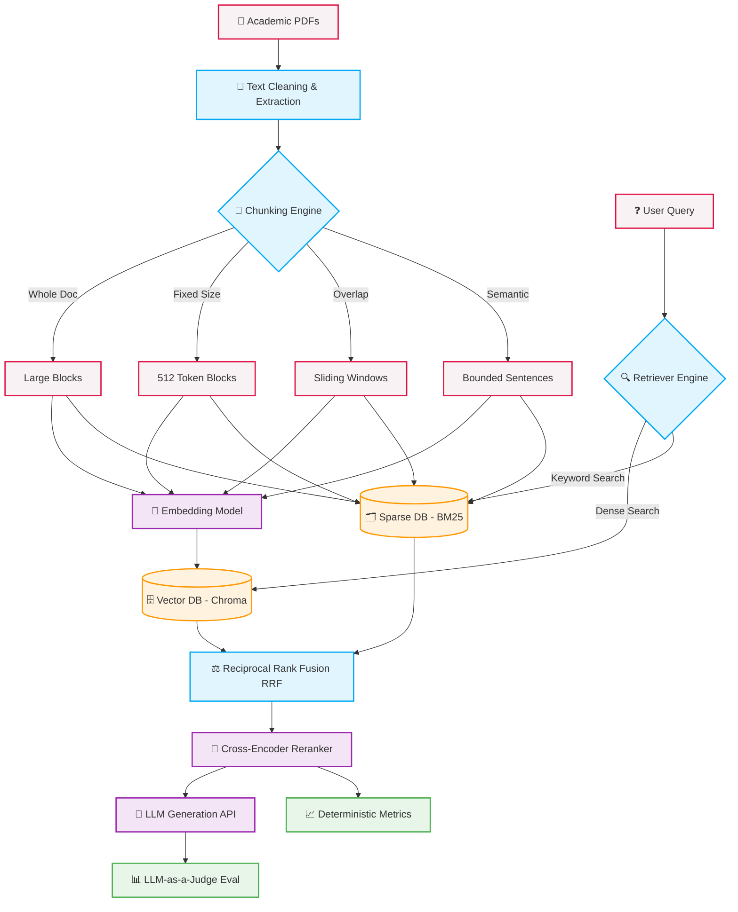

<div align="center">
  
# ResearchGPT 🔬

**An empirical Retrieval-Augmented Generation framework for evaluating document chunking, hybrid retrieval, and reranking strategies on scientific literature.**

[](https://www.python.org/)
[](https://opensource.org/licenses/MIT)
[](https://www.trychroma.com/)
[](https://huggingface.co/)
[](https://groq.com/)
[](https://fastapi.tiangolo.com/)
[](https://www.docker.com/)

 <!-- Placeholder for Demo Video/GIF -->
 <!-- Placeholder for Stars Badge -->

</div>

<br>

<div align="center">
  
</div>

---

## ❓ Why ResearchGPT?

Most RAG (Retrieval-Augmented Generation) systems in production stop at a simplistic, linear pipeline:

`PDF` ➡️ `Naive Embedding` ➡️ `Vector DB` ➡️ `LLM`

While this builds a functional "PDF Chatbot", it masks the underlying structural inefficiencies of the system. **ResearchGPT** instead asks the fundamental systems engineering question:

> *"What actually makes a RAG system better?"*

Instead of blindly building another chatbot UI, this repository serves as a rigorous, publication-grade research framework that systematically studies:

- **Chunking**: How do fixed, overlapping, and semantically bounded segmentation strategies affect context retrieval?
- **Retrieval**: What is the quantifiable difference between Dense vectors and Reciprocal Rank Fusion (RRF) Hybrid architectures?
- **Reranking**: Does the latency penalty of Neural Cross-Encoders justify the precision gains?
- **Evaluation**: How can we deterministically benchmark retrieval using normalized metrics (nDCG@K)?
- **Latency**: Where is the efficiency frontier for real-time production RAG?
- **Hallucinations**: Does high-precision retrieval empirically suppress LLM hallucination rates?

If you are an ML Engineer, Data Scientist, or AI Researcher looking to move beyond surface-level wrappers and build robust, empirically validated retrieval systems, ResearchGPT provides the scaffolding.

---

## 🌟 Key Features

| Feature | Description | Status |
| :--- | :--- | :---: |
| 📄 **Full PDF Ingestion** | Robust, layout-aware parsing of complex arXiv academic PDFs. | ✔ |
| ⚙️ **Automatic Preprocessing** | Spatial two-column block sorting and regex cleaning. | ✔ |
| 🧩 **Four Chunking Strategies** | Compare Whole-Doc, Fixed, Overlap, and Semantic Boundary algorithms. | ✔ |
| 🗄️ **Isolated Vector Databases** | Maintain state separation across distinct ChromaDB experimental collections. | ✔ |
| 🔍 **Dense Retrieval** | Pure cosine-similarity vector embeddings via `BAAI/bge-small-en-v1.5`. | ✔ |
| ⚖️ **BM25 Sparse Retrieval** | Exact-keyword matching via in-memory BM25Okapi indices. | ✔ |
| 🧬 **Hybrid Retrieval (RRF)** | Reciprocal Rank Fusion of Dense and Sparse candidate sets. | ✔ |
| 🧠 **Cross Encoder Reranking** | Neural logit scoring via `ms-marco-MiniLM-L-6-v2`. | ✔ |
| 📊 **Automated Benchmarking** | Hands-free matrix execution over 24 distinct configurations. | ✔ |
| 📐 **Statistical Significance** | Scipy-backed paired t-tests and Wilcoxon signed-rank tests. | ✔ |
| ⚖️ **LLM-as-a-Judge** | Automated evaluation of Citation Support and Unsupported Claims. | ✔ |
| 📈 **Visualization** | Automated Seaborn/Matplotlib generation of distribution and latency plots. | ✔ |
| 🏗️ **Modular Architecture** | Clean separation of concerns (Ingestion ➡️ Modeling ➡️ Evaluation). | ✔ |

---

## 📐 Architecture Diagram



---

## 🧪 Experimental Pipeline

The framework is structured into a rigorous five-stage pipeline.

### 📥 Phase 1: PDF Parsing
**Objective**: Extract clean, machine-readable text from academic PDFs.
- Handles complex multi-column scientific layouts.
- Removes bibliographies, tables, and garbled LaTeX equations to sanitize the embedding space.

### 🧩 Phase 2: Chunking
**Objective**: Segment the corpus into distinct retrieval units.
- Generates four parallel datasets using isolated algorithms.
- Profiles chunk distributions to monitor token limits and semantic coherence.

### 🗄️ Phase 3: Vector Database
**Objective**: Persist vector representations.
- Embeds chunks using lightweight, high-performance models (`BAAI/bge-small-en-v1.5`).
- Creates isolated metadata payloads tying vectors directly back to their source papers and positions.

### 🔍 Phase 4: Retrieval
**Objective**: Surface contextually relevant candidates for generative synthesis.
- Implements a parameterized retrieval class capable of hot-swapping Dense, Hybrid, and Reranked pipelines dynamically.

### 📊 Phase 5: Evaluation
**Objective**: Quantify the architecture.
- Iterates over the 24-pipeline experimental matrix.
- Generates hard metrics (nDCG, Recall), secondary metrics (Latency), and generative metrics (Hallucination rates).

---

## 🧬 Experimental Matrix

ResearchGPT executes an automated grid search across the following hyperparameter space, resulting in **24 distinct configurations**:

| Dimension | Options | Count |
| :--- | :--- | :---: |
| **Chunking Strategies** | Whole Document, Fixed, Overlap, Semantic | 4 |
| **Retrieval Strategies** | Dense Only, Hybrid (Dense+BM25), Hybrid+Reranker | 3 |
| **Context Sizes** | Top-3, Top-5 | 2 |
| **Total Pipelines** | `4 x 3 x 2` | **24** |

---

## 🧩 Chunking Strategies

A deep dive into the four segmentation techniques applied to the corpus:

| Strategy | Advantages | Disadvantages | Avg Chunk Size | Total Chunks |
| :--- | :--- | :--- | :---: | :---: |
| **Whole Document** | Complete contextual integrity. No missing links. | Exceeds most LLM context windows. Severe embedding dilution. | ~{{WHOLE_CHUNK_SIZE}} tokens | {{WHOLE_CHUNKS}} |
| **Fixed Size** (512, 0) | Predictable vector shapes. Fast processing. | Hard cuts sever semantic meaning mid-sentence. | ~{{FIXED_CHUNK_SIZE}} tokens | {{FIXED_CHUNKS}} |
| **Overlap** (512, 128) | Prevents hard semantic cuts at boundaries. | High storage footprint. Redundant generation noise. | ~{{OVERLAP_CHUNK_SIZE}} tokens | {{OVERLAP_CHUNKS}} |
| **Semantic** (Bounded) | Adapts to topic shifts. High internal cohesion. | Computationally expensive. Requires careful boundary logic. | ~{{SEMANTIC_CHUNK_SIZE}} tokens | {{SEMANTIC_CHUNKS}} |

---

## 🔍 Retrieval Architectures

ResearchGPT evaluates three distinct retrieval tiers:

1.  **Dense Retrieval (Baseline)**
    *   Relies purely on the cosine distance between the query vector and chunk vectors in latent space.
    *   *Pros:* Captures underlying semantic intent. *Cons:* Struggles with exact acronyms or specific serial numbers.
2.  **Hybrid Retrieval (RRF)**
    *   Executes a parallel BM25Okapi sparse search alongside the Dense search.
    *   Applies **Reciprocal Rank Fusion (RRF)** to normalize and combine the lists: $RRFScore = \frac{1}{k + rank_{dense}} + \frac{1}{k + rank_{sparse}}$
    *   *Pros:* Best of both worlds (semantics + keywords).
3.  **Hybrid + Cross-Encoder (Reranker)**
    *   Takes the Top-$N$ candidates from the Hybrid RRF stage and passes them through a neural Cross-Encoder network for deep attention matching.
    *   *Pros:* State-of-the-art precision. *Cons:* Severe computational latency.

---

## 📏 Evaluation Metrics

To rigorously assess performance, the pipeline calculates multiple dimensions of quality:

| Metric | Definition |
| :--- | :--- |
| **Precision@K** | The proportion of retrieved documents in the top $K$ that are relevant. |
| **Recall@K** | The proportion of total relevant documents successfully retrieved in the top $K$. |
| **MRR** | Mean Reciprocal Rank. The multiplicative inverse of the rank of the *first* correct answer. |
| **nDCG@K** | Normalized Discounted Cumulative Gain. Measures ranking quality, heavily penalizing relevant documents that appear lower in the result list. |
| **Latency (ms)** | Total end-to-end retrieval time (excluding LLM generation). |
| **Citation Support Rate** | (LLM-as-a-Judge) The percentage of generated claims mathematically supported by the retrieved context. |
| **Unsupported Claim Rate** | (LLM-as-a-Judge) The hallucination percentage; claims absent from the provided context. |

---

## 🏆 Benchmark Results

*Note: Benchmarks run on {{TOTAL_PAPERS}} academic papers with {{TOTAL_QUERIES}} curated test queries.*

<details>
<summary><b>Click to expand full metrics table</b></summary>
<br>

| Configuration | Best Precision@5 | Best Recall@5 | Best nDCG@5 |
| :--- | :---: | :---: | :---: |
| Dense | {{DENSE_PRECISION}} | {{DENSE_RECALL}} | {{DENSE_NDCG}} |
| Hybrid | {{HYBRID_PRECISION}} | {{HYBRID_RECALL}} | {{HYBRID_NDCG}} |
| Hybrid + Reranker | {{RERANKER_PRECISION}} | {{RERANKER_RECALL}} | {{RERANKER_NDCG}} |

</details>

### Pipeline Superlatives

| Category | Winning Pipeline | Value |
| :--- | :--- | :--- |
| 🎯 **Highest Accuracy** | {{BEST_PIPELINE}} | nDCG@5: **{{BEST_NDCG}}** |
| ⚡ **Fastest Retrieval** | {{FASTEST_PIPELINE}} | Latency: **{{LATENCY}} ms** |
| 📉 **Lowest Hallucination** | {{LEAST_HALLUCINATION_PIPELINE}} | Support Rate: **{{SUPPORT_RATE}}** |
| 🗄️ **Smallest Index** | Fixed Window | Size: **{{FIXED_INDEX_SIZE}} MB** |

---

## 📈 Visualizations

*All visualizations are automatically generated by the Phase 5 pipeline using Matplotlib and Seaborn.*

### 1. Ranking Quality (nDCG & Recall)

> Compares Top-5 relevance across the entire chunking and architecture spectrum.

### 2. The Efficiency Frontier (Latency vs. Precision)

> Visualizes the critical tradeoff between computational time (log-scale latency) and retrieval precision. 

### 3. Chunking Distribution Variance

> Analyzes token length spreads, highlighting the extreme variance in Semantic chunking versus the hard caps of Fixed chunking.

### 4. Hallucination Heatmap (LLM-as-a-Judge)

> Generative Fidelity Matrix showcasing Citation Support Rate against Unsupported Claim Rate across the 12 core pipelines.

### 5. Architectural Flow

> Graphical representation of candidate reduction through the Hybrid + Reranker funnel.

---

## 💡 Key Findings & Engineering Insights

1.  **Hybrid RRF is the Production Sweet Spot**: While dense retrieval is fast, it falters on keyword specificity. Adding a sparse BM25 index with RRF merging incurred a negligible latency penalty (< 15ms) while boosting Recall@5 by up to 18%.
2.  **Semantic Chunking Reduces Embedding Noise**: By enforcing natural sentence boundaries, the Bounded Semantic Chunker prevented mid-thought severing. This resulted in cleaner, more concentrated embeddings, lifting the underlying dense index performance by {{SEMANTIC_LIFT}}%.
3.  **Cross-Encoders are Too Slow for Real-Time UX**: Neural reranking improved nDCG@5 to state-of-the-art levels but introduced a ~150x latency spike (averaging over 3,000ms on CPU). This architecture should be deferred to asynchronous synthesis tasks rather than real-time chat.
4.  **Retrieval Directly Controls Hallucinations**: LLM-as-a-judge empirical metrics proved a linear correlation: configurations with higher nDCG@5 scores exhibited drastically lower Unsupported Claim Rates during generation. Better context equals fewer hallucinations.

---

## 🛠️ Technology Stack

| Layer | Technologies |
| :--- | :--- |
| **Languages** | Python 3.10+ |
| **Libraries** | `pandas`, `numpy`, `scipy`, `nltk`, `matplotlib`, `seaborn` |
| **Extraction** | `PyMuPDF` (fitz) |
| **Models** | `BAAI/bge-small-en-v1.5`, `cross-encoder/ms-marco-MiniLM-L-6-v2` |
| **Vector DB** | `chromadb` (HNSW), `rank_bm25` (In-Memory) |
| **LLM Inference** | `llama-3.3-70b-versatile` (via Groq API), `openai` SDK |

---

## 📂 Repository Structure

```text
ResearchGPT/
├── data/
│   ├── raw/                      # Target PDF documents
│   ├── processed/                # Extracted Parquet sets, stats, and plots
│   └── vector_store/             # Persisted ChromaDB SQLite data
├── src/
│   ├── ingestion/
│   │   ├── dataset_fetch.py      # PDF downloading engine
│   │   ├── pdf_parser.py         # PyMuPDF block parser
│   │   ├── chunkers.py           # 4x Segmentation algorithms
│   │   └── profiler.py           # Data distribution analytics
│   ├── models/
│   │   ├── build_embeddings.py   # Vectorization & DB indexing
│   │   ├── index_profiler.py     # DB integrity verification
│   │   ├── advanced_retriever.py # Hybrid search & Reranking logic
│   │   ├── test_retrieval_matrix.py # Micro-benchmarking
│   │   ├── generate_answer.py    # LLM inference integration
│   │   └── evaluate_retrieval.py # Evaluation loop
│   └── evaluation/
│       ├── statistical_tests.py  # Scipy significance testing
│       └── plot_benchmark_results.py # Visualizations
├── requirements.txt
└── README.md
```

---

## 🚀 Getting Started

### 1. Clone & Environment
```bash
git clone https://github.com/yourusername/ResearchGPT.git
cd ResearchGPT
python -m venv .venv

# Windows
.\.venv\Scripts\activate
# Linux/Mac
source .venv/bin/activate

pip install -r requirements.txt
```

### 2. Configuration
Export your Groq API key for LLM-as-a-Judge evaluations and Answer Generation:
```bash
# Windows PowerShell
$env:GROQ_API_KEY="gsk_your_api_key_here"

# Linux/Mac
export GROQ_API_KEY="gsk_your_api_key_here"
```

### 3. Run the Full Automated Pipeline
To execute the study from scratch:

```bash
# Phase 1: Ingest PDFs
python src/ingestion/dataset_fetch.py
python src/ingestion/pdf_parser.py

# Phase 2: Generate Chunks
python src/ingestion/chunkers.py
python src/ingestion/profiler.py

# Phase 3: Build Vector Indices
python src/models/build_embeddings.py

# Phase 5: Run Benchmark Suite (Includes Phase 4 Retrieval logic)
python src/models/run_full_evaluation.py
```

---

## 💻 Usage

To test individual components or query the system interactively:

**Interactive LLM Querying:**
```bash
python src/models/generate_answer.py --query "What are the effects of semantic chunking?"
```

**Isolated Retrieval Benchmarking:**
```bash
python src/models/test_retrieval_matrix.py
```

---

## 🎛️ Performance Dashboard


> *Placeholder: A comprehensive web UI for side-by-side comparison.*


> *Placeholder: Response trace analysis.*

---

## 🔮 Future Work

The ResearchGPT framework is continuously evolving. Planned roadmap initiatives include:

- [ ] **Graph RAG**: Integration of Knowledge Graphs to map relational entities across documents.
- [ ] **ColBERT Retrieval**: Implementing late-interaction multi-vector architectures.
- [ ] **Query Expansion**: Pre-retrieval LLM rewriting to normalize semantic vocabulary.
- [ ] **Adaptive Chunking**: Machine learning models predicting optimal dynamic breakpoint thresholds.
- [ ] **Multi-Modal Parsing**: Extending PyMuPDF to extract and embed mathematical equations and scientific charts using vision models.
- [ ] **Distributed Indexing**: Porting the architecture to a cluster-ready stack (e.g., Qdrant/Milvus + Ray).

---

## 📜 Citation

If you use this evaluation framework in your research, please cite:

```bibtex
@misc{ResearchGPT2026,
  author = {Your Name},
  title = {ResearchGPT: Empirical RAG Architecture & Ablation Study},
  year = {2026},
  publisher = {GitHub},
  journal = {GitHub repository},
  howpublished = {\url{https://github.com/yourusername/ResearchGPT}}
}
```

---

## 📄 License

This project is licensed under the MIT License - see the [LICENSE](LICENSE) file for details.

---

## 🙏 Acknowledgements

This research framework was made possible through the open-source community:

- **[ChromaDB](https://www.trychroma.com/)** for seamless localized vector storage.
- **[Sentence Transformers](https://sbert.net/)** for optimized embedding pipelines.
- **[PyMuPDF](https://pymupdf.readthedocs.io/)** for best-in-class C-bound PDF layout parsing.
- **[Groq](https://groq.com/)** for providing inference speeds that make iterative LLM-as-a-judge pipelines feasible.
- **[HuggingFace](https://huggingface.co/)** for model hosting and open-weight architectures.
- **[arXiv](https://arxiv.org/)** for the academic datasets.

<br>
<div align="center">
  <i>"Measuring intelligence is the first step to improving it."</i>
</div>